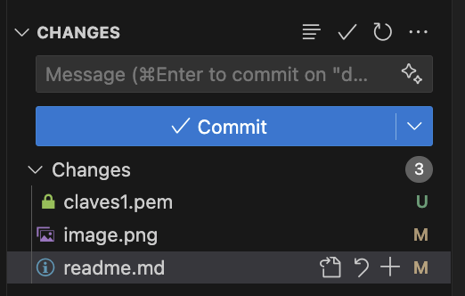
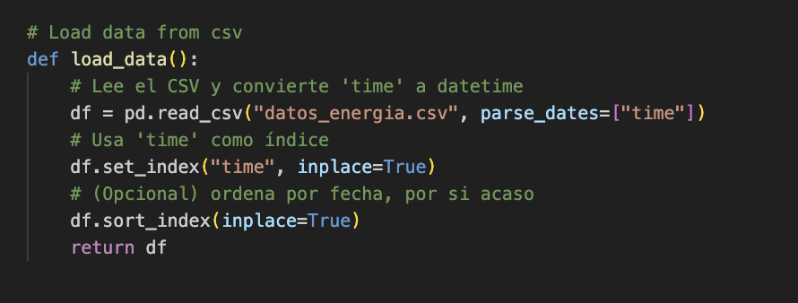
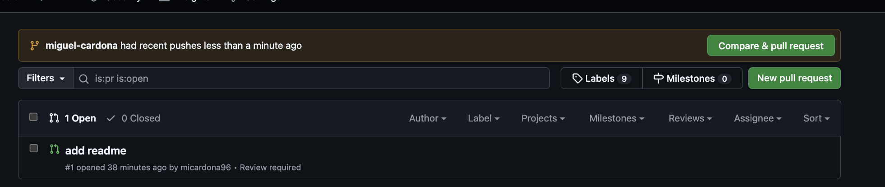
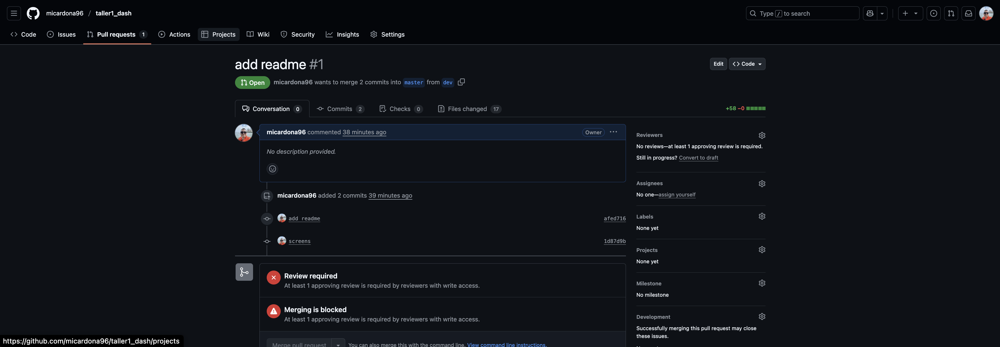
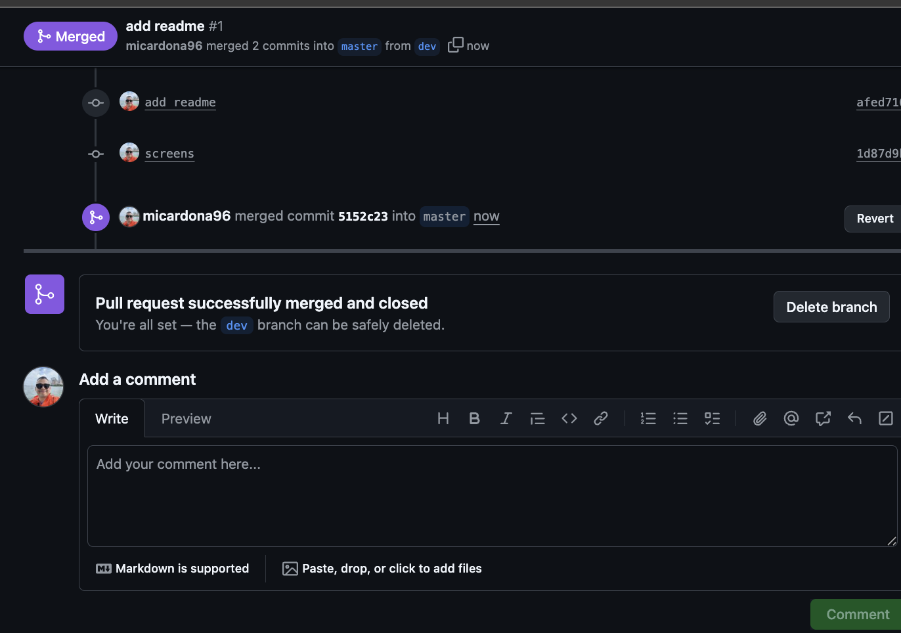

# 📌 Taller: Repositorios en GitHub – README

Este documento contiene los pasos del taller y espacios para incluir las capturas de pantalla solicitadas.

📷 Captura 2 – Staging en VSCode:

	7.	Ver historial:

git log

📷 Captura 3 – Historial inicial:

3. Trabajar con ramas

⸻

4. Publicar en GitHub
https://github.com/micardona96/taller1_dash/pull/1
