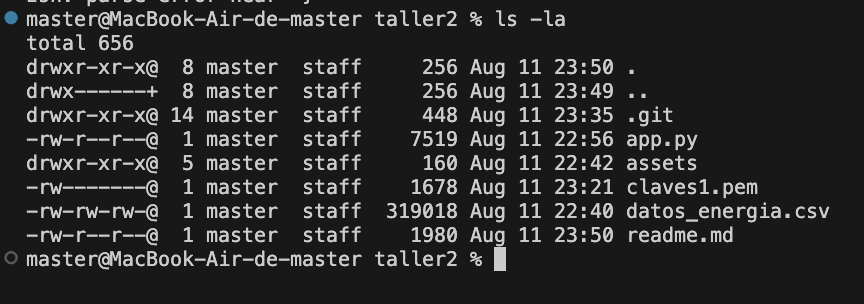

# Taller: Desplegando un tablero en la nube

Miguel Angel Cardona Chamorro

---

## 1. Configuración del repositorio local con Git
Breve descripción de la configuración inicial de Git y creación del repositorio local.

**Capturas requeridas:**
- Ejecución de `git init`

- Configuración de usuario y correo en Git

- Modificación en la función `load_data()` en `app.py`

- Tablero corriendo en local en el navegador

---

## 2. Subida del código a GitHub
[Repositorio de GitHub](https://github.com/micardona96/taller1_dash)

**Capturas requeridas:**
- Vista del repositorio en GitHub con todos los archivos (`app.py`, `datos_energia.csv`, carpeta `assets`)

- Historial de commits

---

## 3. Configuración de la máquina virtual
**Capturas requeridas:**

- Conexión a la máquina virtual por SSH

- Ejecución de `sudo yum update -y`

- Instalación de Python, pip, pandas, dash, gunicorn, git

- Carpeta clonada desde el repositorio remoto en la máquina virtual (`ls` mostrando los archivos)

---

## 4. Lanzamiento del tablero en la nube
**Capturas requeridas:**
- Modificación en `app.py` para `host="0.0.0.0"`

- Cambio guardado y enviado a GitHub desde la VM

- Configuración del Security Group en AWS (puerto 8050)

**Enlace al tablero en la nube:** 
http://13.221.45.232:8050/
